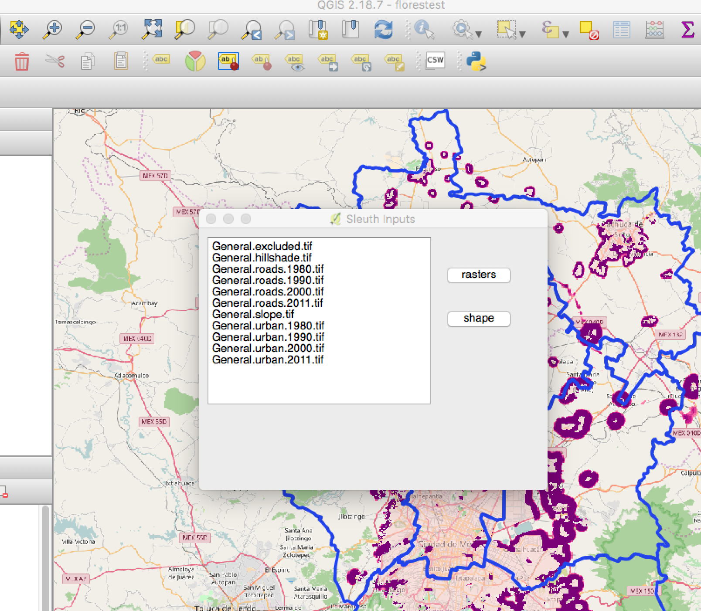
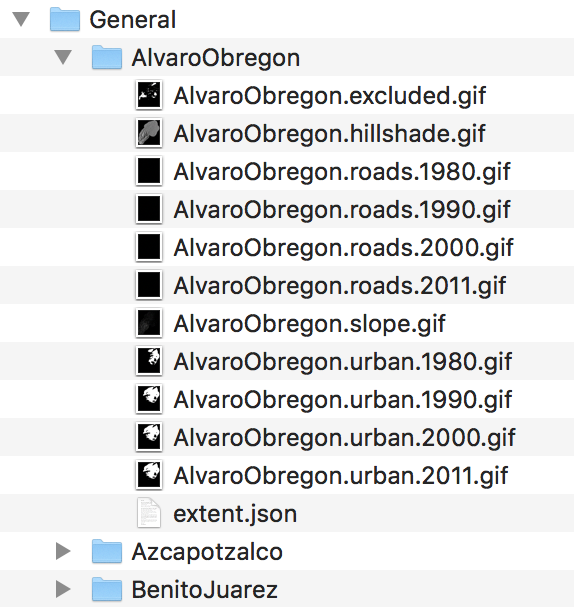

# SLEUTH input layers from QGIS
This plugin helps to create folders containing input layers to run [SLEUTH urban growth model](http://www.ncgia.ucsb.edu/projects/gig/). For this version general rasters in tif format and a shape file with subregions are needed. A field named “location” in the subregions shape file with intended names for subregions is needed, this will change in future versions, to make it even easier for the user. 
While processing, it will create extent.json files for each subregion containing needed data to transform gif outputs from SLEUTH to proper tif rasters.

To test the plugin there is a folder named "General" with rasters of Mexico city basin and a shapefile to generate subregions. Pick "General" folder for rasters and the shapefile named delegaciones.shp to test it.

This material is based upon work supported by the National Science Foundation under Grant No. 1414052, CNH: The Dynamics of Multi-Scalar Adaptation in Megacities (PI H. Eakin), with additional support from the Inter-American Institute for Global Change Research under Collaborative Research Network-CRN3: “Coping with hydrological risk in megacities: Collaborative planning framework for the Mexico City Metropolitan Area” (Project number: CRN3108).
